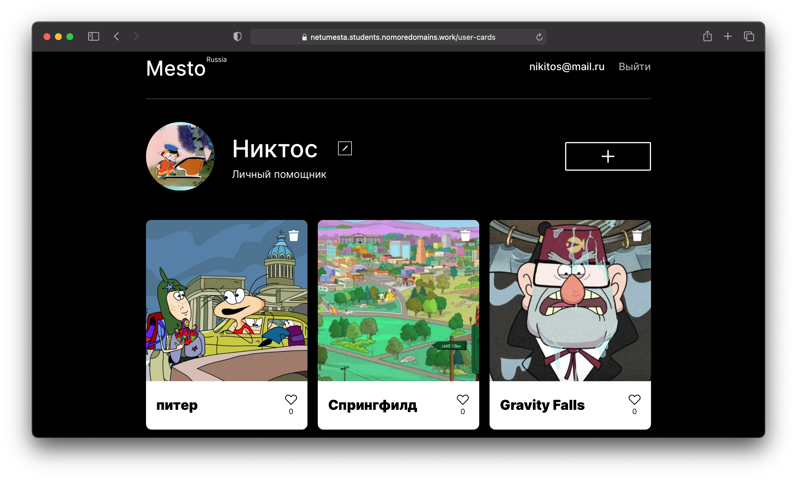

# REACT-MESTO-API-FULL

## О проекте
"Mesto" — инстаграм путешественника. Основная функциональность сервиса — добавление и удаление карточек мест, редактирование профиля пользователя, лайки. В сервисе реализована авторизация, есть редактирование профиля пользователя. 
[Ссылка на приложение](https://netumesta.students.nomoredomains.work/)

### Начать работу
Проект состоит из двух частей: frontend и backend, в каждой из этих директорий есть README.md, описывающий запуск проекта.  

### Работа над этим проектом включает в себя освоение/использование таких практик как:
* создание темплейта приложения - Create React App
* создание функциональных компонентов
* хуки useState, useEffect, useRef для хранения и управления состоянием компонентов
* использование React.createContext для передачи данных во все компоненты приложения
* HOC ProtectedRoute для переадресации неавторизованных пользователей
* работа с localStorage, хранение токена авторизации
* создание контроллеров, роутов и обработчиков серверной части 
* централизованная обработка ошибок
* валидация запросов на всех этапах: до контроллеров, в контроллерах, в схемах
* логирование запросов и ошибок
* создание сервера в Яндекс облаке, развертывание api, деплой фронтенда
* регистрация домена и поддомена для фронтенда и бэкенда, подключение сертификатов для обращения по https

### Используемые технологии
HTML · CSS · BEM · JS · React JS · git · npm · Node JS · Express JS · MongoDB · Mongoose · Nginx · YandexCloud